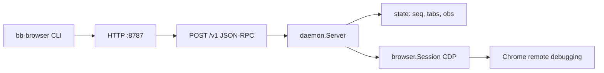

# go-bb-browser

用 **Go** 实现的 [bb-browser](https://github.com/epiral/bb-browser) 风格工具链：**CLI（`bb-browser`）→ 本地 HTTP 守护进程（`bb-daemon`）→ 仅通过 CDP 控制已启动的 Google Chrome**。守护进程**不会启动浏览器**，只通过 **chromedp** 附加到你用 `--remote-debugging-port`（等）拉起的 Chrome；**无扩展、不支持其他浏览器**。

详细里程碑与不变量见 [`docs/IMPLEMENTATION_PLAN.md`](docs/IMPLEMENTATION_PLAN.md)；面向 Agent 的约定见 [`AGENTS.md`](AGENTS.md)。

## 构建与测试

```bash
go build -o bb-daemon ./cmd/bb-daemon
go build -o bb-browser  ./cmd/bb-browser
go test ./...
```

## 快速开始

1. 启动带远程调试的 Chrome（可用 CLI 辅助）：

   ```bash
   ./bb-browser launch
   # 标准输出为 host:port，例如 127.0.0.1:9222 → 供 bb-daemon --debugger-url 使用
   ```

2. 启动守护进程（附加到上一步的调试端口）：

   ```bash
   export BB_BROWSER_DEBUGGER_URL=127.0.0.1:9222   # 或每次传 --debugger-url
   ./bb-daemon
   # 默认监听 127.0.0.1:8787；可用 --listen 或 BB_BROWSER_LISTEN
   ```

3. 用 `bb-browser` 调接口（默认 `--url http://127.0.0.1:8787`，可用 `BB_BROWSER_URL` 覆盖）。

---

## `bb-daemon` 架构

数据流：**客户端（CLI / 任意 HTTP） → `bb-daemon` HTTP → JSON-RPC 分发 → `internal/browser`（chromedp CDP 会话）→ Chrome**。

| 层级 | 职责 |
|------|------|
| **`cmd/bb-daemon`** | 解析 `--debugger-url` / `--listen`（及对应环境变量），构造 `daemon.Config`，启动 `daemon.Server`。 |
| **`internal/daemon`** | `http.ServeMux`：`GET /health` 返回 JSON `{"status":"ok"}`；`POST /v1` 解析 [JSON-RPC 2.0](https://www.jsonrpc.org/specification)，按 `method` 分发到各 handler。维护与 Chrome 的 **单一 CDP 会话**（启动时 `connectBrowserLocked`），失败时可重连（`ensureBrowserSession`）。 |
| **`internal/state`** | **全局单调 `seq`**（`SeqGen`）；**短 tab id 注册表**（`TabRegistry`，关 tab 释放 id、清缓冲）；**按 tab 隔离的观测环形缓冲**（`TabObsStore` + `ringbuf`），满足 INV-1～INV-7 类不变量。 |
| **`internal/daemon`（观测）** | `obsSink` 把 CDP 事件写入 `TabObsStore`；`syncObservation` 与 `tab_list` 等路径对齐目标列表并清理已关闭 target 的缓冲。 |
| **`internal/browser`** | chromedp：`Session` 持有远程 allocator 上下文，执行 `goto` / `eval` / `click` / `snapshot` / Fetch 域路由等；**不**负责启动 Chrome。 |
| **`pkg/protocol`** | JSON-RPC 请求/响应与各 `method` 的 params/result 类型，供 daemon 与 `pkg/daemonclient` 共用。 |



**环境变量（节选）**

| 变量 | 含义 |
|------|------|
| `BB_BROWSER_DEBUGGER_URL` | Chrome DevTools 端点（`host:port` 或 ws/http URL），等价 `--debugger-url` |
| `BB_BROWSER_LISTEN` | daemon 监听地址，默认 `127.0.0.1:8787` |

**HTTP API 摘要**：`POST /v1` 体为 JSON-RPC：`jsonrpc`、`method`、`params`、`id`。成功时 `result`；失败时 `error`（`code`、`message`、可选 `data`）。业务成功响应在适用处带 **`tab`** 与 **`seq`**；网络/控制台/错误等观测类结果带 **`cursor`** / **`events`** 等（见 `pkg/protocol` 与现有 README 中的方法表）。非 POST 访问 `/v1` 返回 **405**。

Daemon 已实现但 **CLI 未封装** 的 JSON-RPC 方法：`tab_focus`（返回当前可操作 tab 元数据）。

**`POST /v1` 支持的 `method`（与 `pkg/protocol` 常量一致）**

| `method` | 说明 |
|----------|------|
| `tab_list` | 列出 page target / 焦点 tab |
| `tab_focus` | 同步后返回当前可操作 tab 元数据 |
| `tab_select` | 切换 daemon 焦点 tab |
| `tab_new` | 新建 tab（可选 `url`） |
| `tab_close` | 关闭 tab |
| `goto` | 导航 |
| `reload` | 刷新 |
| `screenshot` | 截图（`png` / `jpeg`） |
| `eval` | 执行脚本 |
| `click` / `fill` | 点击 / 填表（`selector` 或 `ref`） |
| `snapshot` | 可交互树与 `@ref` |
| `fetch` | 页内 HTTP |
| `network` / `network_clear` | 网络观测读 / 清缓冲 |
| `network_route` / `network_unroute` | Fetch 域拦截 |
| `console` / `console_clear` | 控制台观测 |
| `errors` / `errors_clear` | 页面错误观测 |

---

## `bb-browser` CLI 命令一览

**根命令全局选项**

| 选项 | 环境变量 | 说明 |
|------|----------|------|
| `--url` | `BB_BROWSER_URL` | `bb-daemon` 根 URL，默认 `http://127.0.0.1:8787`（无尾部 `/`） |
| `--json` | — | 打印原始 JSON-RPC（部分子命令为完整 envelope） |
| `--tab` | — | 短 tab id；省略则用 `tab_list` 返回的 daemon 焦点 tab |
| `-v` / `--version` | — | 打印版本并退出 |

---

### `health`

- **作用**：`GET {--url}/health`。
- **参数**：无。

---

### `launch`

- **作用**：在本机启动 Google Chrome（`--remote-debugging-port` + 持久 profile），标准输出打印 **`host:port`**，供 `bb-daemon --debugger-url` 使用。
- **参数**：无子命令参数。

| 选项 | 环境变量 | 说明 |
|------|----------|------|
| `--chrome` | `BB_BROWSER_CHROME` | Chrome 可执行文件路径；空则自动探测 |
| `-p` / `--profile` | `BB_BROWSER_PROFILE` | `--user-data-dir`；空则用各 OS 默认目录 |
| `--port` | — | 调试端口，默认 `9222` |
| `--bind` | — | `--remote-debugging-address`，默认 `127.0.0.1` |
| `--headless` | — | `--headless=new` |
| `--detach` | — | 默认 `true`：Chrome 后台跑，命令立即返回 |
| `--extra-arg` | — | 传给 Chrome 的额外参数（可重复） |
| `--start-url` | — | 启动时打开的 URL，默认 `about:blank` |
| `--wait-ready` | — | 默认 `true`：等待 CDP 端口可连 |
| `--wait-timeout` | — | `--wait-ready` 超时，默认 `15s` |

---

### `open URL`

- **作用**：新 tab 打开 URL（`tab_new`）；`--current` 时在焦点 tab 上 `goto`。
- **选项**：`--current`、`--wait N`（新开 tab 后睡眠秒数，便于慢页面）。

---

### `tab`

| 子命令 | 作用 | 备注 |
|--------|------|------|
| `tab list` | `tab_list` | |
| `tab new [url]` | `tab_new`；省略 url 为 `about:blank` | |
| `tab select` | `tab_select` | 必须 `--id <短id>` **或** `--index <1-based>`（按 tab id 排序） |
| `tab close` | `tab_close` | `--id` / `--index`；都不给则用 `--tab` 或焦点 tab |

---

### `snapshot`

- **作用**：页面树快照 JSON-RPC（含 `@ref` → 选择器映射）。
- **选项**：`-i` / `--interactive`、`-c` / `--compact`、`-d` / `--depth`、`-s` / `--scope`（CSS 根范围）。

---

### `eval SCRIPT…`

- **作用**：`eval`，脚本为剩余所有参数拼接。

---

### `click SELECTOR_OR_@REF`

- **作用**：`click`；`@N` 形式走 `ref`，否则走 CSS `selector`。

---

### `fill SELECTOR_OR_@REF TEXT…`

- **作用**：`fill`；首参为选择器或 `@ref`，其余为文本。

---

### `fetch URL`

- **作用**：页内 `fetch`（`fetch` JSON-RPC，带 cookie 等页面身份）。
- **选项**：`--method`、`--headers`（JSON 对象字符串）、`--body`、`--output`（写响应体到文件）。

---

### `screenshot [path.png]`

- **作用**：`screenshot`；默认解码 base64 写文件（路径参数或 `--output`，否则自动生成文件名）。
- **选项**：`--format`（`png` / `jpeg`）。

---

### `html`

- **作用**：通过 `eval` 取 `document.documentElement.outerHTML`；可选只保留“可见”子树（`--visible-only`，见命令 `--help` 长说明）。
- **选项**：`-o` / `--output`、`--format`（`html` / `markdown`）、`--visible-only`。

---

### `reload`

- **作用**：`reload` 当前/焦点 tab。

---

### `refresh`

- **作用**：`reload` 的隐藏别名。

---

### `close`

- **作用**：关闭 `--tab` 或焦点 tab（`tab_close`）。

---

### `goto URL`

- **作用**：对当前 tab `goto`。

---

### `console [filter]`

- **作用**：读控制台缓冲（`console`）；`--clear` 时调用 `console_clear`。
- **选项**：`--since`、`--filter`、`--grep`、`--with-body`。

---

### `errors [filter]`

- **作用**：读 JS 错误类缓冲（`errors`）；`--clear` → `errors_clear`。
- **选项**：同 `console`。

---

### `network`

| 子命令 | 作用 |
|--------|------|
| `network requests [FILTER]` | `network`；可选 URL 子串过滤；`--since`、`--with-body` |
| `network clear` | `network_clear` |
| `network route URL_PATTERN` | `network_route`（CDP Fetch 拦截）；`--abort`、`--body`、`--content-type`、`--status` |
| `network unroute [URL_PATTERN]` | `network_unroute`；省略 pattern 则清除全部规则 |

---

### `run SCRIPT.js [args…]`

- **作用**：读取适配器 JS 文件，组装参数后 `eval` 在页面执行（见 `internal/site`、`skills/bb-browser/references/script-system.md`）。
- **首参**：磁盘上的 `.js` 路径；其余为 CLI 参数（含 `--name value`）。

---

## 示例

```bash
./bb-browser launch --port 9222
./bb-daemon --debugger-url 127.0.0.1:9222

./bb-browser health
./bb-browser open https://example.com
./bb-browser snapshot -c
./bb-browser click '@1'
./bb-browser tab list --json
```

IPv6 本机调试地址可使用 `::1:9222`（daemon 会规范化为 `[::1]:9222`）。

---

## 相关包

- [`pkg/daemonclient`](pkg/daemonclient/README.md)：Go 语言 JSON-RPC 客户端封装。
