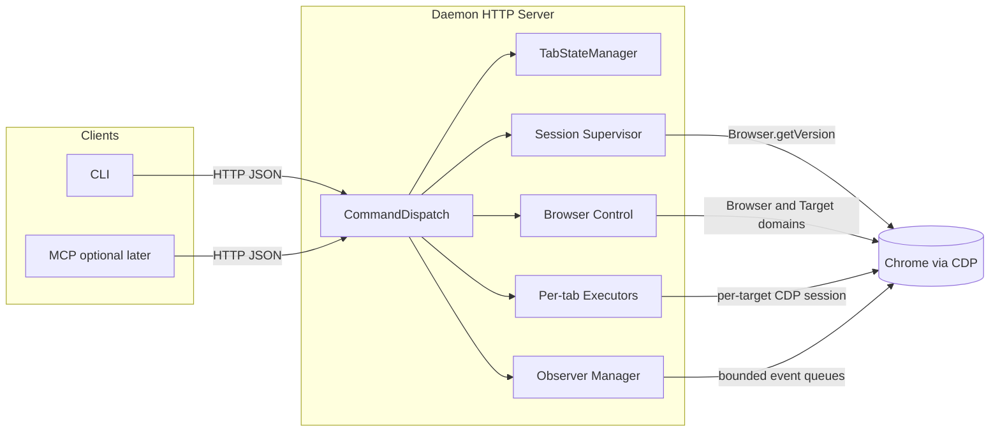

# go-bb-browser 实现与架构说明

本文档描述用 **Go** 复刻 **bb-browser** 的分层与行为，底层仅通过 **[chromedp](https://github.com/chromedp/chromedp)**（Chrome DevTools Protocol）与 **Google Chrome** 通信——**不包含 Chrome 扩展**，也**不支持 Chrome 以外的浏览器**。本文同时记录 Issue #17 后落地的 session supervisor、target 生命周期和 observation 背压设计。

参考上游（架构与不变量）：[epiral/bb-browser](https://github.com/epiral/bb-browser) 及其 `AGENTS.md` 中的组件图与设计不变量（短 tab ID、`seq`、环形缓冲等）。

---

## 1. 目标与边界

### 1.1 目标

- **人机与 Agent 双场景**：提供可脚本化的 CLI，以及可选的本地 HTTP API（后续可再接 MCP），让 Agent 能控制「已登录的真实浏览器会话」。
- **语义对齐 bb-browser**：命令/请求模型、响应里的 **`tab` + `seq`**、观察类数据的 **`cursor` + since 过滤**、以及 AGENTS.md 中的 **INV-1～INV-7**。
- **实现语言**：Go；CDP 客户端：**chromedp**。**daemon 永远不自行启动浏览器**：只通过 CDP **附加到用户已在跑的 Chrome**（典型为已开启 `--remote-debugging-port` 或等价调试端点）。

### 1.2 非目标（首期可刻意不做）

- **Chrome 扩展**：明确 **不做**。与上游 bb-browser（扩展 + CDP）不同，本项目 **只保留 daemon ↔ Chrome 的 CDP 通路**，不维护扩展、不向浏览器侧注入扩展逻辑。
- **与上游协议字节级兼容**：优先 **概念与不变量一致**；JSON 字段名可对齐，但若 Go 生态或 CDP 抽象导致差异，在文档与迁移说明中显式列出。
- **其他浏览器**：明确 **不支持**。实现与文档均假定 **Google Chrome**（chromedp + CDP）；Edge、Firefox、Safari、其他 Chromium 分支不在支持范围内，Issues 可一律关闭为 out of scope。
- **由 daemon 启动 Chrome 进程**：明确 **不做**。启动带调试端口的 Chrome、选择 profile、传命令行参数等，均由 **用户或外层脚本/安装器** 负责；daemon 只接收 **调试 WebSocket URL**（或 host:port）并连接。

### 1.3 关键约束（chromedp 视角）

- chromedp 基于 **Chrome DevTools Protocol**。本项目里 **唯一允许的用法**是：**附加到已存在的调试端点**（例如用户已用 `--remote-debugging-port` 启动 Chrome，daemon 使用 **`chromedp.NewRemoteAllocator`** 连接对应 `ws://…`），以保留登录态、cookies。
- daemon **不得**使用 **`chromedp.NewExecAllocator`**（或任何会 `exec` 浏览器二进制的路径）作为产品行为；若集成测试需要机器上先有 Chrome，应在测试 harness 里由 **测试脚本** 启动 Chrome，而非 daemon 代码启动。

---

## 2. 总体架构（对齐 bb-browser）

沿用上游的三段式思路，将 **MCP** 视为「另一 front-end」，与 CLI 并列连到同一 daemon。



### 2.1 组件职责映射

| bb-browser 概念 | Go 侧职责 |
|----------------|-----------|
| **CdpConnection**（WebSocket、session 复用） | **browser control + per-tab executor**：Browser/Target 控制命令只走 browser executor；每个 target 缓存独立 chromedp context。 |
| **TabStateManager**（短 ID、`seq`、环形缓冲） | **tab 注册表**：短 ID ↔ CDP target id；全局 **`seq` 生成器**；每 tab 的 network/console/error **ring buffer**。 |
| **CommandDispatch**（action → handler） | **HTTP 路由 + 命令分发**：解析请求 → 读取 supervisor 状态 → 校验 tab → 调窄能力接口 → JSON 响应。 |

### 2.3 Session supervisor 与生命周期协调器

- supervisor 状态为 `ready → suspect → failed`。后台每 5s 以 browser executor 执行一次 `Browser.getVersion`，单次 2s；连续 3 次失败后确认 failed，拒绝新的 browser RPC 并让 daemon 非零退出。明确的 WebSocket context 断开立即 failed；普通 target 操作超时只触发合并、限频的异步探测。
- 不做进程内重连。Chrome 和 daemon 仍是独立进程，systemd / Docker 负责重启 daemon。
- `Target.targetCreated/targetInfoChanged/targetDestroyed` 进入容量有限的非阻塞队列；溢出置 dirty，消费端执行一次完整 `Target.getTargets` resync。
- registry 同步返回 removed target，由 daemon 的单一清理路径释放短 ID、idle、observation ring、route、tab context 和引用计数 keyed lock，集中保证 INV-6。
| CLI / MCP | **cmd/** 下的 CLI；MCP 可作为后续 `stdio`→HTTP 的薄适配层。 |

### 2.2 数据平面 vs 控制平面

- **控制平面**：上层命令（导航、点击、输入、截图、执行 JS、tab 生命周期）。
- **数据平面**：CDP 事件流（`Network.*`、`Runtime.consoleAPICalled`、`Page.*` 等）进入 **每 tab 缓冲**，并按 **`seq`** 打标签供增量查询。

---

## 3. 协议与类型设计（Go）

### 3.1 请求/响应 envelope

建议拆成三层，便于 CLI 与 HTTP 共用：

1. **传输层**：HTTP `POST /v1` 或按 action 分路径（实现时再定）；统一 `Content-Type: application/json`。
2. **协议层**：与 bb-browser 对齐的核心字段：
   - `action`（字符串或枚举）
   - `tab`（短 ID，可选/必填依 action）
   - `since`（可选，用于观察类增量）
   - 各 action 的专用字段（URL、选择器、键入文本等）
3. **观测层**：`seq`、`cursor`、错误结构 `{ error, hint, action }`（UX 规范可照 AGENTS.md）。

### 3.2 `pkg/protocol` 包

- **Action 枚举**：与上游功能集逐步对齐（`tab_list`、`tab_new`、`open`、`snapshot`、`click`、`fill`、`eval`、`network`、`console`…）。
- **类型定义**：Request/Response 用 **显式 struct + `json` tag**；避免 `map[string]any` 充斥业务路径。
- **版本化**：路径或 header 中带 `v1`，为未来破坏性变更留出口。

### 3.3 短 tab ID 策略（对齐 INV）

- 从 CDP **`TargetID`** 派生短 ID：例如取末尾 **4+ hex**，冲突时 **自动加长**，保证唯一。
- **全局 map**：`shortId -> targetInfo`，以及反向 `targetId -> shortId`。
- **INV-3**：解析失败或找不到 → **明确错误码 + 提示**，禁止默认落到「第一个 tab」。

---

## 4. 模块与仓库布局（建议）

以下为建议的 Go module 布局，实施时可微调命名，但保持边界清晰：

```
go-bb-browser/
  cmd/
    bb-browser/          # CLI 入口（或沿用上游命令名）
    bb-daemon/           # daemon 入口（可选与 CLI 同 binary 子命令）
  internal/
    daemon/
      server.go          # HTTP server、live/ready/health
      v1.go              # JSON-RPC 解析与 dispatch
      rpc_connections.go # handler 使用的窄 CDP 能力接口
      rpc_observation.go # observation 查询与租约
      browser_reconnect.go # supervisor 与 target event 同步
    browser/
      remote.go          # 仅 Remote allocator：调试 URL / ws 连接（不启动浏览器）
      session.go         # browser control 与 per-tab context
      observer.go        # on-demand domains、队列与 worker
      errors.go          # transport / target gone / timeout 类型化错误
    state/
      tab_registry.go    # 短 ID、target 元数据
      seq.go             # 全局 seq（INV-4）
      ringbuf.go         # 环形缓冲与 since 过滤（INV-5）
      subscribers.go     # CDP 事件订阅与归类
    cdphooks/            # Network / Log / Runtime 事件绑定（可选拆分）
  pkg/
    protocol/            # 请求/响应类型、JSON-RPC 常量（对外可 import）
  docs/
    IMPLEMENTATION_PLAN.md
```

**依赖边界**：

- `cmd/*` 依赖 `internal/daemon`、`pkg/protocol`（或其它 `pkg/*` 客户端库）。
- `daemon` 依赖 `browser` + `state`，不要反向依赖。
- CDP 细节封装在 `internal/browser`，避免泄漏到 CLI。

---

## 5. chromedp 集成策略

### 5.1 Allocator：仅附加已有 Chrome（不启动浏览器）

daemon **只**使用 **`chromedp.NewRemoteAllocator`**，连接到用户已暴露的调试端点（例如从 `http://127.0.0.1:9222/json/version` 取得 `webSocketDebuggerUrl`，或配置里直接提供 `ws://…`），再 **`chromedp.NewContext`**。

| 配置项（示意） | 用途 |
|----------------|------|
| **Debugger 地址** | 如 `127.0.0.1:9222` 或完整 WebSocket URL；daemon 启动时必填，连接失败则报错退出或健康检查失败。 |

文档与 `--help` 需说明：**请先自行启动 Chrome 并开启远程调试**（例如 `--remote-debugging-port=9222`，具体以官方文档为准）。CLI 可提供「打印推荐启动命令」类辅助，但 **不负责** `exec` Chrome。

### 5.2 Target / Tab 模型

- 使用 CDP **`Target.getTargets`** / **`Target.attachToTarget`**（或 chromedp 封装）列出 page 类型 target。
- **每个 page target** 对应 daemon 中的一个 **tab** 实体；**iframe** 是否暴露为子 target 首期可简化（多数交互在顶层 page）。
- **`tab_new`**：**INV-7** 要求在零 tab 时仍可创建——实现顺序应为「能创建 target → 再考虑 attach 默认 page」，避免 `ensurePageTarget` 类逻辑阻塞创建路径。

### 5.3 Session 生命周期

- **每个 tab** 维护独立、按需 attach 且缓存的 chromedp context；某个 tab 超时或 target gone 不改变全局 supervisor 状态。
- **tab 关闭**：daemon 先通过 browser executor 执行 `Target.closeTarget`；成功后立即走统一清理。外部关闭由 `Target.targetDestroyed` 进入同一路径。
- **连接断开**：transport、target gone、request timeout 使用不同错误类别。WebSocket 断开立即退出；watchdog 持续失败确认后退出；不做热替换。
- `tab_list` 只执行一次 `Target.getTargets` 并组装 registry 缓存，不 attach、eval 或启动 observer。`tab_focus` 才并发刷新 visibility（最多 16 路、每 tab 500ms、整体 5s）；只有全部成功且唯一 visible 才更新缓存。

### 5.4 命令映射（示意）

以下为「规划级」映射，不代表 CDP 调用已定型：

| 高层 action | CDP / chromedp 方向 |
|-------------|---------------------|
| navigate | `Page.navigate` |
| snapshot / DOM 查询 | `DOMSnapshot` / `DOM.getDocument` + 序列化策略 |
| click / type | `DOM.querySelector` + `Input.dispatchMouseEvent` / `Input.insertText` |
| screenshot | `Page.captureScreenshot` |
| eval | `Runtime.evaluate` |
| network 日志 | `Network.enable` + request/response 事件入 ring buffer |
| console | `Runtime.enable` + `Runtime.consoleAPICalled` |
| errors | `Log.enable` / `Runtime.exceptionThrown` |

---

## 6. TabStateManager 与事件缓冲

### 6.1 全局 `seq`（INV-4）

- 单一 **互斥或原子**计数器：任何「操作完成」或「捕获到事件」都递增并写入对应记录。
- **禁止复用旧 seq**；缓冲淘汰只丢 **最老** 记录，不影响新 seq 单调性。

### 6.2 环形缓冲参数（起点）

可默认与上游数量级一致，作为可配置项：

- network：约 **500** 条
- console：约 **200** 条
- errors：约 **100** 条

### 6.3 查询语义（INV-2、INV-5）

- 请求带 **`since`**：只返回 `seq > since` 的事件。
- 响应带 **`cursor`**（通常等于最新一条相关 `seq` 或单独游标结构），便于 Agent 增量拉取。
- **INV-5**：过滤条件必须绑定 **单个 tab**，禁止跨 tab 泄漏。

### 6.4 Observation 背压与租约

- network、console、errors 在各自第一次查询时启用对应 CDP domain，每次查询续租；默认空闲 5m 后 disable，配置为 0 时保持到 tab 关闭。
- 首次查询前不保留该观测类型的历史事件。
- 每个 observed tab 有容量 1024 的非阻塞入口队列。CDP listener 只提取字段、分配全局 seq 和 `select` 投递；worker 负责 JSON 编码与 ring 写入。
- 队列满时丢弃并计数，listener 不等待。响应的 `dropped` 合并入口丢弃和 ring 淘汰，`cursor` 至少推进到 listener 已见的最大 seq。
- observer 租约到期只取消 listener 并 disable domain，不取消仍存活的 chromedp target context，避免意外关闭 Chrome tab。

---

## 7. 能力与缺口（相对 bb-browser）

### 7.1 纯 CDP 能较好覆盖的

- 导航、截图、执行 JS、大部分 DOM 交互。
- Network / Console 的事件订阅与缓冲。
- 多 tab 管理与附加。

### 7.2 可选增强（二期，仍为纯 CDP）

- **站点级「adapter」或注入脚本**：无需扩展；若需要页面内 helper，仅用 CDP，例如 **`Page.addScriptToEvaluateOnNewDocument`** 注入小型脚本（仍属 daemon 发起的 CDP，不引入扩展）。
- **强对抗站点的指纹/真人检测**：真实 Chrome profile + remote attach 仍是核心手段；chromedp 无法控制浏览器以外的系统层行为。

---

## 8. HTTP Daemon 设计

### 8.1 监听与安全

- 默认仅 **`127.0.0.1`**（上游 daemon 端口思路一致；具体端口实现期再定）。
- **可选 token**：Header 或 query 鉴权，防止本机其他用户访问。
- **请求体大小限制**，防止大图/大 JSON DoS。

### 8.2 并发模型

- **每 tab 串行**：同一 tab 的命令队列化，避免竞态（点击与导航交错）。
- **跨 tab 并行**：不同 short id 可并行（受浏览器单进程模型限制时有自然瓶颈）。
- CDP **回调**进入 channel，由单一 goroutine 写入 ring buffer，避免锁反转。

### 8.3 错误与可观测性

- 结构化日志（`slog`）：request id、tab、action、耗时。
- **metrics 钩子**（可选）：进行中命令数、缓冲溢出次数、watchdog 状态切换次数。

### 8.4 HTTP 健康语义

- `GET /live`：纯 HTTP liveness，不访问 CDP；进程 supervisor 使用它。
- `GET /ready`：读取 watchdog 最新状态，`suspect` / `failed` 返回 503；流量入口使用它。
- `GET /health`：兼容原响应结构且不再同步探测；`ready` / `suspect` 为 connected/200，confirmed failed 为 disconnected/503。

---

## 9. CLI 设计（对齐 UX 分组思想）

CLI 仅是 HTTP 客户端 + 人类可读格式化：

1. **入门**：`run`（adapter JS 路径）等；早期可用 **`docs` + stub** 替代部分能力。
2. **浏览器操作**：`open`、`snapshot`、`click`、`fill`…
3. **页面信息**：`screenshot`、`eval`、`get`…
4. **标签页**：`tab list`、`tab new`…
5. **调试**：`network`、`console`、`errors`…

输出：**JSON mode**（`--json`）优先满足 Agent；默认输出可做表格（人类）。

---

## 10. 测试策略

| 层级 | 内容 |
|------|------|
| **单元测试** | `ringbuf`、`short id` 碰撞、`seq` 单调性、请求校验。 |
| **契约测试** | HTTP API  golden JSON（不含环境相关字段）。 |
| **集成测试**（可选 CI） | 测试 job 先用 **脚本** 启动带 debugging 的 Chrome，再启动 daemon **仅 Remote attach**；daemon 代码路径不启动浏览器。 |

---

## 11. 分阶段里程碑

### Phase 0 — 脚手架

- Go module、`cmd` 骨架、配置结构体（含 **debugger URL**）、静态编译说明。
- **不接 CDP**：daemon 可先返回 health（配置项可校验必填）。

### Phase 1 — 附加已有 Chrome + tab 列表

- **仅** Remote allocator 连接用户已启动的 Chrome。
- `tab_list`、`tab_select`（若有）、**短 ID 注册**。
- **INV 基础单元测试**。

### Phase 2 — 核心自动化

- `open`、`screenshot`、`eval`、基础 `click`/`type`。
- 错误模型 `{ error, hint, action }`。

### Phase 3 — 观察类

- Network / Console / Errors 订阅 + ring buffer + `since`/`cursor`。
- **压力与溢出**策略（丢弃最老 + 计数器）。

### Phase 4 — CLI 抛光与可选 MCP

- CLI `--json`、帮助分组、与上游 UX 对齐度评估。
- MCP server 作为单独 `cmd` 或子项目，避免拖慢核心交付。

---

## 12. 风险与决策记录（待实施时填充）

建议在仓库中维护 `docs/ADR/`（Architecture Decision Records）：

- **已定**：daemon 不启动浏览器，仅 Remote attach（若需记录在 ADR 里可写 ADR-001）。
- 每 tab 一个 chromedp context vs 共享 browser context 的取舍。
- snapshot 的 DOM 表示（纯文本、简化 a11y 树、或 HTML 片段）对 token 体积的影响。

---

## 13. 参考链接

- [bb-browser（epiral）](https://github.com/epiral/bb-browser)
- [chromedp](https://github.com/chromedp/chromedp)
- [Chrome DevTools Protocol](https://chromedevtools.github.io/devtools-protocol/)

---

**结论**：本项目的实现路径是 **先 Daemon + 状态机 + INV 不变量**，再 **chromedp 仅以 Remote 方式接通已在跑的 Chrome**，最后补 **观察面与 CLI/MCP**。浏览器进程生命周期始终在 daemon 外，daemon 只负责 CDP 会话与命令分发。
